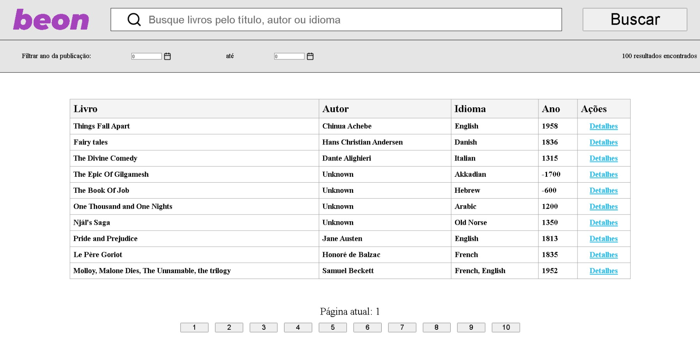
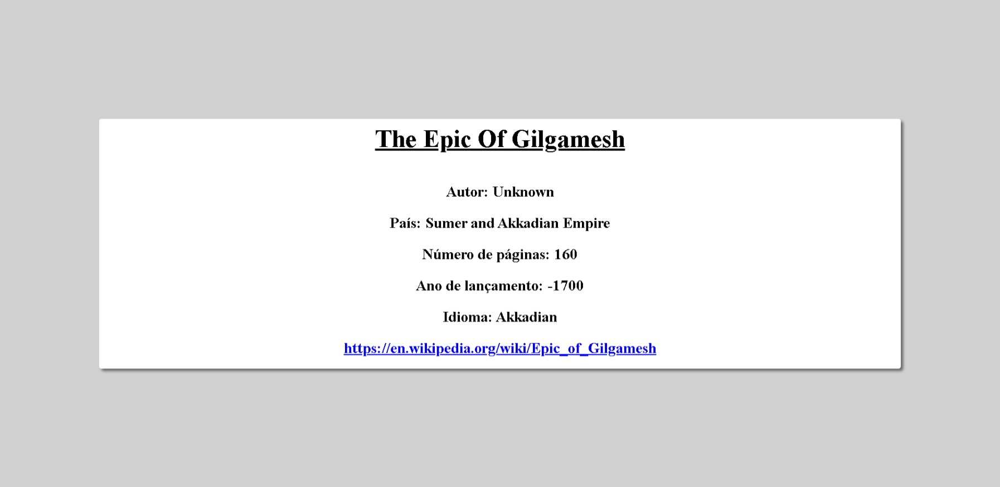

<h1>Beon Challenge</h1>

<h2>Bem vindo!</h2>

<h2>Objetivo:</h2>

Esse projeto foi criado como desafio para o processo seletivo da Beon.

se trata de um site para visualizar informações de livros como título, autor, ano de lançamento, idioma e número de páginas.

<h2>Rodando o projeto localmente:</h2>

Para rodar esse projeto localmente, primeiro é necessário ter a api de livros rodando localmente, para isso visite o repositório <a href="https://github.com/Josimar-Souza/beonjsonserver" target="_blank">beon json server</a> e siga as instruções do readme para rodar a api localmente.

Tenha em mente que também é necessário ter o <code>node.js</code> instalado em seu computador, se ainda não tiver visite o site do <a href="https://nodejs.org/en/" target="_blank">node</a>, baixe e instale!

Feito isso siga os passos a seguir:

<ol>
  <li>Primeiro clone o repositório para sua máquina utilizando <code>git clone</code>.</li>
  <li>Entre no diretório do repositório e rode o comando <code>npm install</code> para instalar todas as dependências to projeto.</li>
  <li>Por fim, rode o comando <code>npm start</code>.</li>
</ol>

Depois de seguir os passos, o projeto deve abrir em seu navegador!

<h2>Rodando os testes:</h2>

O projeto também contém testes criados com a biblioteca <a href="https://testing-library.com/docs/react-testing-library/intro/" target="_blank">React testing library</a>.

Todos os testes se encontram no cominho <code>/src/tests</code>

Para rodar os testes localmente você precisa ter instalado todas as dependências do projeto como mostrado anteriormente, depois disso basta rodar um dos comandos abaixo

Para rodar todos os teste utilize o comando: <code>npm test</code>

Para rodar um teste específico utilize o comando: <code>npm test {nome do arquivo de teste}</code>

<h2>Tecnologias utilizadas:</h2>
<ul>
  <li><a href="https://pt-br.reactjs.org/" target="_blank">React</a></li>
  <li><a href="https://testing-library.com/docs/react-testing-library/intro/" target="_blank">React Testing Library</a></li>
  <li><a href="https://www.npmjs.com/package/axios" target="_blank">Axios</a></li>
  <li><a href="https://styled-components.com/" target="_blank">Styled-Components</a></li>
  <li><a href="https://www.npmjs.com/package/react-router-dom" target="_blank">React-Router-Dom<a/></li>
  <li><a href="https://eslint.org/" target="_blank">ESLint</a></li>
</ul>

<h2>Imagens da aplicação:</h2>

Página principal:

Página de detalhes:

<h2>Contato:</h2>

contact.josimarsouza@gmail.com

<a href="https://www.linkedin.com/in/josimar-souza-brito/" target="_blank">Linkdin</a>
